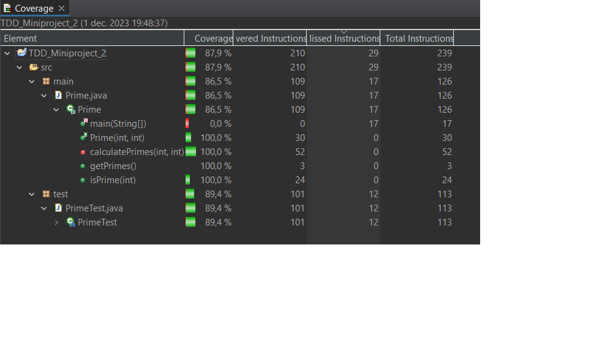

Det största problemet jag hade med denna uppgiften var att mitt test för att kolla antal primtal och summan av dem vägrade att fungerar då jag tittade på fel ställen och använde fel data. När jag väl insåg detta så flöt mitt arbete på relativt bra. Fick ett litet problem med stack overflow när jag började med boundary testing men jag löste det till slut.

